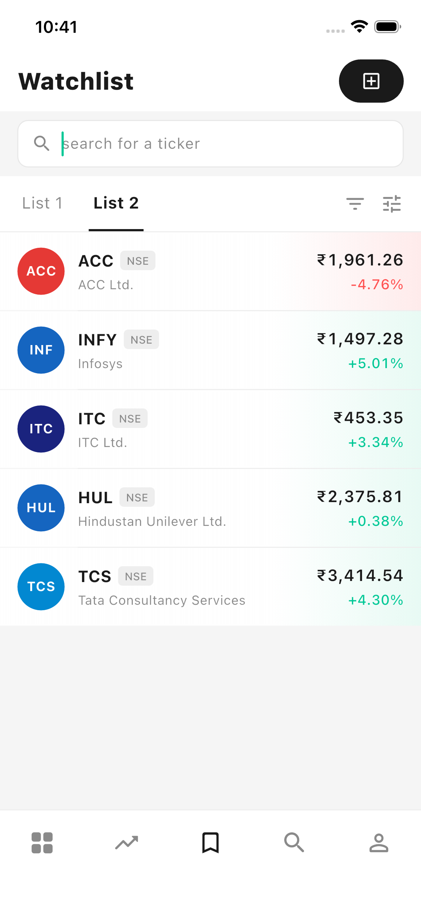
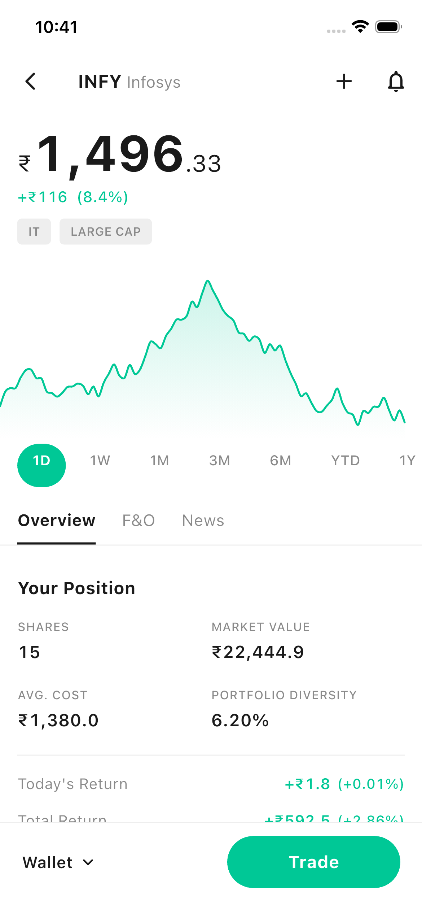

# 📈 Flutter Trading App 
## ✨ Features

- **Live Watchlist** — Real-time simulated price ticks with gain/loss color flash
- **Stock Detail Page** — Full price history chart with 7 time range tabs
- **User Position** — Shares, market value, avg cost, portfolio diversity, returns
- **INR Formatting** — Correct Indian numbering system (2-2-3 grouping)
- **Isolate-based chart generation** — Heavy computation off the main thread
- **Animated price updates** — Smooth `AnimatedSwitcher` + `AnimatedContainer`

---

## 🏗️ Architecture

This app strictly follows **Clean Architecture** with three isolated layers per feature:

### Layer Rules

| Layer | Rule |
|---|---|
| **Domain** | Pure Dart only — zero Flutter imports |
| **Data** | Implements domain contracts — owns all mock/stream logic |
| **Presentation** | Depends only on BLoC — never repositories or models |

---

```markdown
<p align="center">
  
  
</p>
```

---

